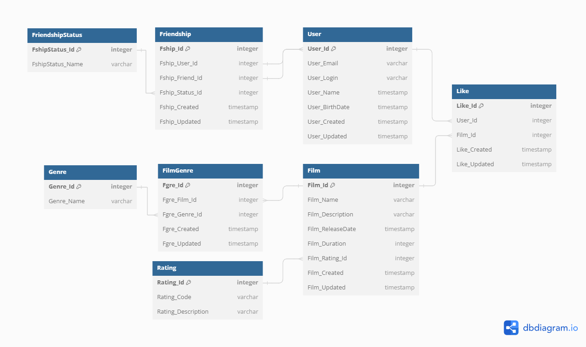

# java-filmorate
### DB Scheme



### Database entity discription

##### User - Stores information about all users
| № | Column Name    | Description          | Type       | Key | Reference |
|---|----------------|----------------------|------------|-----|-----------|
| 1 | User_Id        | Identifier           | integer    | PK  |           |
| 2 | User_Email     | Email                | varchar    |     |           |
| 3 | User_Login     | Login                | varchar    |     |           |
| 4 | User_Name      | Name                 | varchar    |     |           |
| 5 | User_BirthDate | User`s Birthdate     | timestamp  |     |           |
| 6 | User_Created   | User`s Creation date | timestamp  |     |           |
| 7 | User_Updated   | User`s update date   | timestamp  |     |           |


##### Film - Stores information about all films
|  № | Column Name      | Description          | Type      | Key  | Reference   |
|----|------------------|----------------------|-----------|------|-------------|
| 1  | Film_id          | Identifier           | integer   | PK   |             |
| 2  | Film_Name        | Film Name            | varchar   |      |             |
| 3  | Film_Description | Description          | varchar   |      |             |
| 4  | Film_ReleaseDate | Release Date         | timestamp |      |             |
| 5  | Film_Duration    | Duration in mins     | integer   |      |             |
| 6  | Rating_id        | Rating               | integer   | FK   | Rating      |
| 7  | Film_Created     | Film`s Creation date | timestamp |      |             |
| 8  | Film_Updated     | Film`s update date   | timestamp |      |             |

##### Friendship - Intersection table between users friend requests
| №   | Column Name     | Description       | Type      | Key  | Reference        |
|-----|-----------------|-------------------|-----------|------|------------------|
| 1   | Fship_id        | Identifier        | integer   | PK   |                  |
| 2   | Fship_User_id   | User Identifier   | integer   | FK   | User             |
| 3   | Fship_Friend_id | Friend Identifier | integer   | FK   | User             |
| 4   | Fship_Status_id | Request Status    | integer   | FK   | FriendshipStatus |
| 5   | Fship_Created   | Creation date     | timestamp |      |                  |
| 6   | Fship_Updated   | update date       | timestamp |      |                  |

---
##### Like - Stores all user`s film likes
| №  | Column Name    | Description     | Type      | Key  | Reference    |
|----|----------------|-----------------|-----------|------|--------------|
| 1  | Like_id        | Identifier      | integer   | PK   |              |
| 2  | Film_id        | Film Identifier | integer   | FK   | Film         |
| 3  | User_id        | User Identifier | integer   | FK   | User         |
| 5  | Like_Created   | Creation date   | timestamp |      |              |
| 6  | Like_Updated   | update date     | timestamp |      |              |

---
##### FilmGenre - Stores all film`s genres
| №   | Column Name   | Description      | Type      | Key  | Reference  |
|-----|---------------|------------------|-----------|------|------------|
| 1   | Fgre_Id       | Identifier       | integer   | PK   |            |
| 2   | Fgre_Film_id  | Film Identifier  | integer   | FK   | Film       |
| 3   | Fgre_Genre_id | Genre Identifier | integer   | FK   | Genre      |
| 5   | Fgre_Created  | Creation date    | timestamp |      |            |
| 6   | Fgre_Updated  | update date      | timestamp |      |            |

##### Genre - List of all Genres
| №    | Column Name   | Description    | Type      | Key   | Reference  |
|------|---------------|----------------|-----------|-------|------------|
| 1    | Genre_id      | Identifier     | integer   | PK    |            |
| 2    | Genre_Name    | Genre`s name   | varchar   |       |            |

---
##### Rating - List of all ratings
| №    | Column Name        | Description | Type    | Key   | Reference   |
|------|--------------------|-------------|---------|-------|-------------|
| 1    | Rating_id          | Identifier  | integer | PK    |             |
| 2    | Rating_Code        | Rating code | varchar |       |             |
| 3    | Rating_Description | Description | varchar |       |             |

---
##### FriendshipStatus - List of all friendship statuses
| №   | Column Name      | Description           | Type       | Key    | Reference  |
|-----|------------------|-----------------------|------------|--------|------------|
| 1   | FshipStatus_id   | Identifier            | integer    | PK     |            |
| 2   | FshipStatus_Name | Frienship Status name | varchar    |        |            |


### Query examples

##### Query for get all users
````sql
Select * from user
````

##### Query for specific user fields
````sql
Select u.User_Name,
u.User_Login,
u.User_Email
from user u
where u.User_Id = 5
````
##### Query for film likes
````sql
Select count(*) 
from Like l
where l.Film_Id = 4
````

##### Query for all user`s friends
````sql
select * from user u
where u.user_id in
 (select f.friend_id from Frienship f 
 where f.Fship_User_Id = 5 and f.Fship_Status_Id = 1)
````